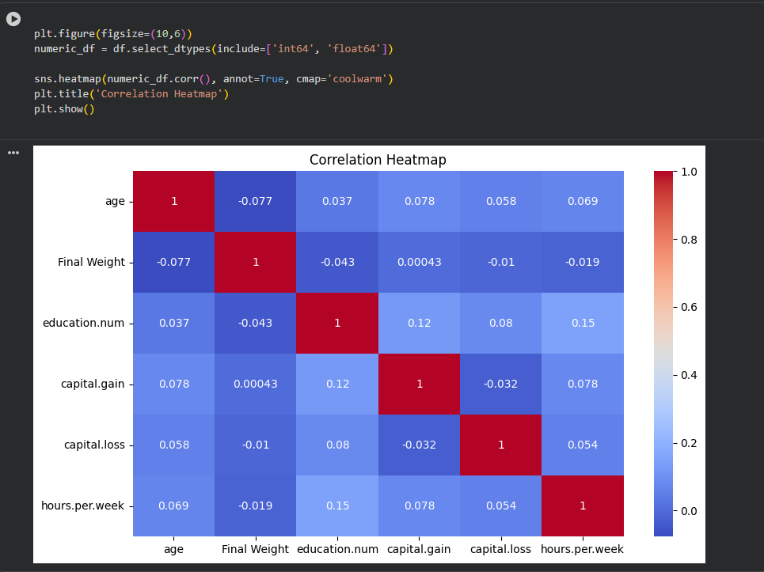
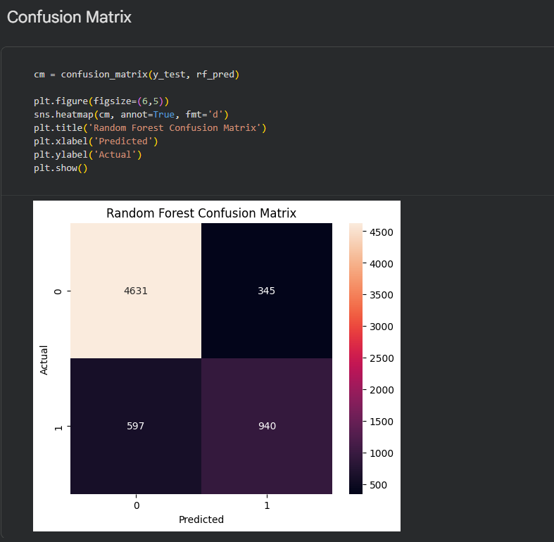

# Adult Income Analysis

## Overview
In this project I analyzed the Adult Income dataset and built ML models to predict income category.

## Technologies
- Python
- Pandas
- NumPy
- Seaborn
- Scikit-learn

## Steps
- Data Cleaning
- EDA
- Feature Encoding
- Feature Scaling
- Machine Learning

## Models Used
- Logistic Regression
- Decision Tree
- Random Forest
## Visualizations

### Correlation Heatmap

### Confusion Matrix

## Results
Random Forest achieved the best accuracy.

## Dataset
UCI Adult Income Dataset
